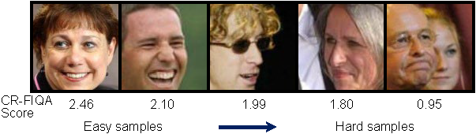

# Sorting images using CR-FIQA scores
This section explains how the Certainty Ratio Face Image Quality Assessment **(CR-FIQA)** scores were used as a curriculum to sort the [MS-Celeb-1M](https://doi.org/10.1007/978-3-319-46487-9_6) images from "easy" to "difficult". To understand the **CR-FIQA** algorithm and how it is implemented, read the paper below and follow the steps in the repository below.

- Paper: [CR-FIQA paper](https://openaccess.thecvf.com/content/CVPR2023/html/Boutros_CR-FIQA_Face_Image_Quality_Assessment_by_Learning_Sample_Relative_Classifiability_CVPR_2023_paper.html)
- Code: [CR-FIQA repository](https://github.com/fdbtrs/CR-FIQA)

 

## Overview

We propose a two-stage curriculum learning strategy based on **CR-FIQA** scores. The training begins with high-quality (easy) images and progressively incorporates more difficult samples.

### Key Components

- **CR-FIQA Framework**: Used to estimate the **Face Image Quality (FIQ)** of each sample. This framework learns to predict the **relative classifiability** of images.
- **Image Sorting**: Samples are scored using CR-FIQA and sorted in **descending order** based on quality.  
  - **High scores** → Easy-to-classify images  
  - **Low scores** → Hard-to-classify images

### Training Strategy

The sorted images are then fed to the [FedFR]() algorithm in the following stages:

1. **Stage 1**: Train on the **top 50%** of images (those with the highest CR-FIQA scores).
2. **Stage 2**: Use the model parameters from Stage 1 as initialization and train on **all** images.

## References

If you use this work, please cite the original [CR-FIQA](https://openaccess.thecvf.com/content/CVPR2023/html/Boutros_CR-FIQA_Face_Image_Quality_Assessment_by_Learning_Sample_Relative_Classifiability_CVPR_2023_paper.html) paper.