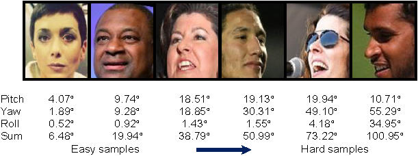

# Sorting Images Using Head Pose Angles

This section explains how the **head pose angles** which we estimated using **OpenFace** were used as a curriculum to sort the [MS-Celeb-1M](https://doi.org/10.1007/978-3-319-46487-9_6) dataset images from "easy" to "difficult." To understand how to estimate the **head pose angles**, please refer to the paper and repository below:

- 📄 **Paper**: [OpenFace: An open source facial behavior analysis toolkit](https://ieeexplore.ieee.org/abstract/document/7477553)  
- 💻 **Code**: [OpenFace GitHub Repository](https://github.com/TadasBaltrusaitis/OpenFace)

## Overview

We sort dataset images from "easy" to "difficult" based on head pose angles. The difficulty is estimated by computing the sum of the absolute values of the pitch, yaw, and roll angles using the [OpenFace 2.0](https://github.com/TadasBaltrusaitis/OpenFace) toolkit.

## Curriculum Strategy

- **Sorting**: For each client, images are ranked by the sum of absolute head pose angles.
- **Subset Splitting**:
We tried different splitting criteria but the best results were obtained using the following as shown in our [preliminary work](https://www.scitepress.org/Papers/2024/125740/125740.pdf):
   - 🟩 **Easy samples**: Top 50% (with low head pose angles).
   - 🟥 **Difficult samples**: Bottom 50% (with high head pose angles).
- **Training Process**:
   - **Stage 1**: Train the model on easy samples.
   - **Stage 2**: Initialize with Stage 1 parameters and continue training on all samples.

## References

Baltrušaitis, T., Robinson, P., & Morency, L.P. (2016). OpenFace: An open source facial behavior analysis toolkit. In *2016 IEEE Winter Conference on Applications of Computer Vision (WACV)* (pp. 1–10).
