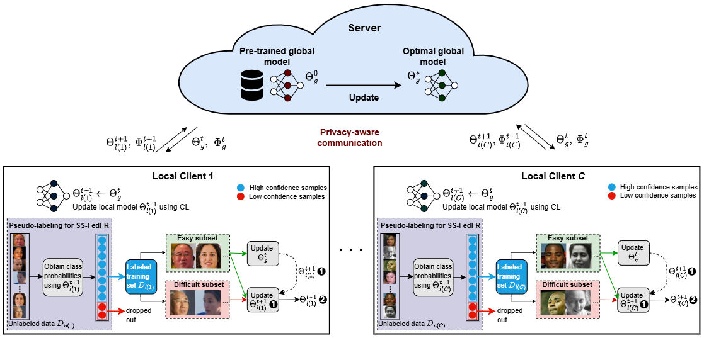

# Semi-Supervised Federated Face Recognition (SSFedFR)

This repository presents a **Semi-Supervised Federated Face Recognition (SSFedFR)** approach that leverages **partially labeled local datasets** and curriculum learning strategies to improve model performance across clients.

 

## Overview

In this approach, each client has access to a local dataset that is only **partially labeled**. The training process of the SSFedFR model involves two main components:

### 1. Pseudo-Labeling Strategy

To utilize the **unlabeled data**, we propose a pseudo-labeling method based on **softmax confidence scores**:

- For each unlabeled image, the model generates class probabilities using the **softmax layer**.
- If the **maximum class probability** exceeds a predefined **pseudo-labeling confidence threshold**, the image is assigned a pseudo-label.
- Only pseudo-labeled images with sufficient confidence are included in training.

This process is formalized in **Algorithm 1**.

### 2. Curriculum Learning Integration

To enhance learning, we further integrate **curriculum learning** techniques into the semi-supervised federated training:

- **HR Curriculum**: Based on head pose difficulty (e.g., pitch, yaw, roll angles).
- **CR-FIQA Curriculum**: Based on image quality assessment using classifiability scores.

The combined training pipeline is illustrated in **Figure 3**.

---

## Summary of Contributions

- A **pseudo-labeling function** for confident prediction filtering.
- Integration of **head pose (HR)** and **CR-FIQA** curricula into semi-supervised federated training.
- A robust **SSFedFR training strategy** for partially labeled client datasets.

---

## Visuals

- **Algorithm 1**: Pseudo-labeling procedure  
- **Figure 3**: Full training pipeline with curriculum integration

---